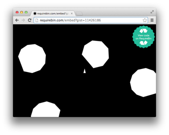

# Quintus + Browserify

This is an npm-friendly and [browserified](https://github.com/substack/node-browserify) fork of [Quintus](https://github.com/cykod/Quintus).

# Install
Make sure you have [node.js](http://nodejs.org) installed

Then in your project folder:

```
$ npm install quintus
```

Now in your code you can
```js
var Quintus = require('quintus')
```


# Examples

You can run and live edit these examples on RequireBin:

[](http://requirebin.com/?gist=11424891)
[](http://requirebin.com/?gist=11426186)
[](http://requirebin.com/?gist=11426151)
[](http://requirebin.com/?gist=11426543)

# Usage

Browserified Quintus differs with mainline Quintus only in how it requires the Quintus engine and modules.

A sample module file:
```js
module.exports = function(Q) {
    Q.gravityY = 0;
}
```

And here is how you can load Quintus and this module
```js
var Quintus = require('quintus')
Quintus.MyModule = require('./my-module')

window.addEventListener('load',function() {
    var Q = Quintus().include("Sprites, Scenes, Input, Anim, 2D")
                     .include("MyModule")
                     .setup({ width: 320, height: 416 });
});
```

# Local Installation

First clone and install:
```
git clone https://github.com/seanewest/quintus
cd quintus
npm install
```

Install [beefy](https://github.com/chrisdickinson/beefy) for fast and fun browserify development
```
$ npm install -g beefy
```

Now you can run each example like so:
```
$ cd examples/ball
$ beefy ball.js --open
```

# License
MIT / GPLv2